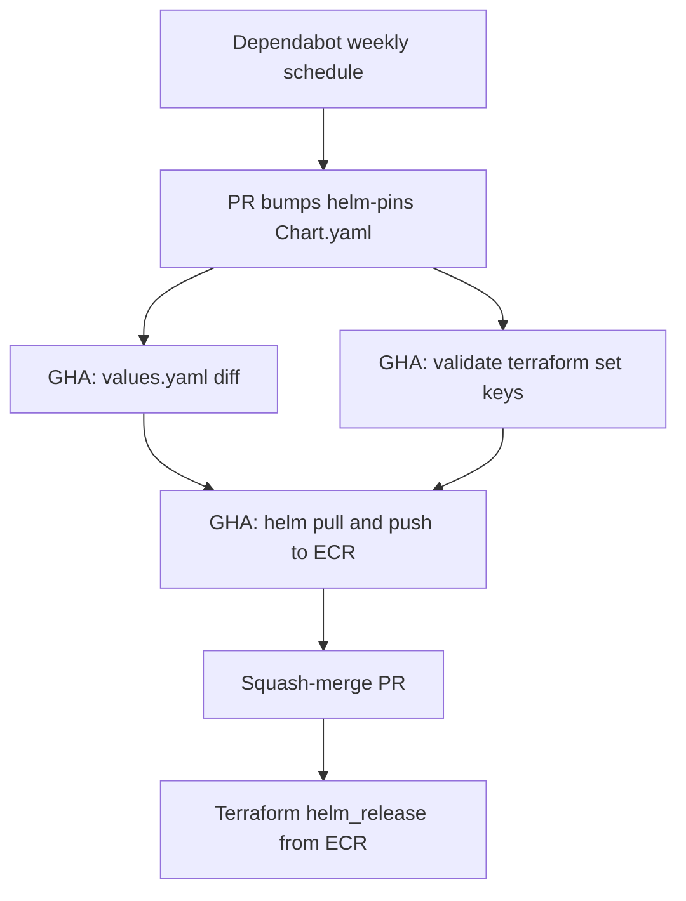

# Helm chart update automation

This repository pins community Helm charts, deploys them with Terraform `helm_release` from a private Amazon ECR registry, and automates upgrades with Dependabot plus GitHub Actions.

Tracked charts:

| Chart | Public Helm repository | Current pin |
| --- | --- | --- |
| `aws-load-balancer-controller` | https://aws.github.io/eks-charts | 3.5.0 |
| `secrets-store-csi-driver` | https://kubernetes-sigs.github.io/secrets-store-csi-driver | 1.6.0 |
| `cluster-autoscaler` | https://kubernetes.github.io/autoscaler | 9.59.0 |

## How it works



1. Dependabot inspects each pin chart under `helm-pins/` and opens one PR per chart when a newer version exists.
2. GitHub Actions diffs upstream `values.yaml` between the base pin and the new pin, and posts the diff on the PR.
3. GitHub Actions parses Terraform `set { name = ... }` blocks and fails the PR if any override path is missing from the new chart defaults.
4. On Dependabot PRs, after those checks pass, Actions pulls the community chart and pushes it to private ECR, then squash-merges the PR.
5. Terraform CD (outside this workflow) applies `terraform/helm`, which reads the merged pin version and installs from ECR.

Native Dependabot cannot bump `version` inside a `helm_release` block. The pin `Chart.yaml` files are the source of truth; Terraform reads them with `yamldecode`.

## Repository layout

```
helm-pins/<chart>/Chart.yaml   # Dependabot version pins
helm-pins/catalog.yaml         # Public repo + Terraform file mapping
terraform/ecr/                 # Private ECR repositories (apply first)
terraform/helm/                # helm_release CD contract, installs from ECR
scripts/                       # Diff, set-key validation, ECR publish
.github/dependabot.yml
.github/workflows/helm-chart-update.yml
```

## Apply order

ECR repositories must exist before the first chart publish (the publish job will also create a missing repository as a fallback).

```bash
cd terraform/ecr
cp terraform.tfvars.example terraform.tfvars
# edit aws_region
terraform init
terraform apply
```

After a version is published to ECR, deploy with your existing Terraform CD:

```bash
cd terraform/helm
cp terraform.tfvars.example terraform.tfvars
# edit account, region, cluster, VPC
terraform init
terraform apply
```

`terraform/helm` is a CD contract, not a full EKS cluster. Provision the cluster, IRSA service accounts, and IAM roles separately. The example releases assume:

- `aws-load-balancer-controller` service account already exists (`serviceAccount.create=false`)
- `cluster-autoscaler` service account already exists (`rbac.serviceAccount.create=false`)

## GitHub configuration

Set these **repository variables** (Settings → Secrets and variables → Actions → Variables):

| Variable | Purpose |
| --- | --- |
| `AWS_ACCOUNT_ID` | Account that owns the private ECR registry |
| `AWS_REGION` | Region of the ECR registry |
| `AWS_ROLE_ARN` | IAM role GitHub Actions assumes via OIDC |

Create an IAM role trusted by GitHub OIDC for this repository (`token.actions.githubusercontent.com`). Allow at least:

- `ecr:GetAuthorizationToken`
- `ecr:CreateRepository`
- `ecr:DescribeRepositories`
- `ecr:BatchCheckLayerAvailability`
- `ecr:PutImage`
- `ecr:InitiateLayerUpload`
- `ecr:UploadLayerPart`
- `ecr:CompleteLayerUpload`

Trust policy (replace account, repo, and org):

```json
{
  "Version": "2012-10-17",
  "Statement": [
    {
      "Effect": "Allow",
      "Principal": {
        "Federated": "arn:aws:iam::ACCOUNT_ID:oidc-provider/token.actions.githubusercontent.com"
      },
      "Action": "sts:AssumeRoleWithWebIdentity",
      "Condition": {
        "StringEquals": {
          "token.actions.githubusercontent.com:aud": "sts.amazonaws.com"
        },
        "StringLike": {
          "token.actions.githubusercontent.com:sub": "repo:ORG/REPO:*"
        }
      }
    }
  ]
}
```

Enable GitHub OIDC for AWS in the account (`aws iam create-open-id-connect-provider` for `https://token.actions.githubusercontent.com`) if it is not already present.

If branch protection requires reviews, allow GitHub Actions / Dependabot to squash-merge, or the publish job will push to ECR and then fail at `gh pr merge`.

## Local checks

```bash
pip install -r scripts/requirements.txt
python3 scripts/test_validate_helm_set_keys.py
```

With Helm installed:

```bash
./scripts/diff-chart-values.sh aws-load-balancer-controller --skip-comment
./scripts/validate-chart-set-keys.sh aws-load-balancer-controller
```

Publishing (requires AWS credentials and the variables above):

```bash
export AWS_ACCOUNT_ID=123456789012 AWS_REGION=us-east-1
./scripts/push-chart-to-ecr.sh aws-load-balancer-controller
```
